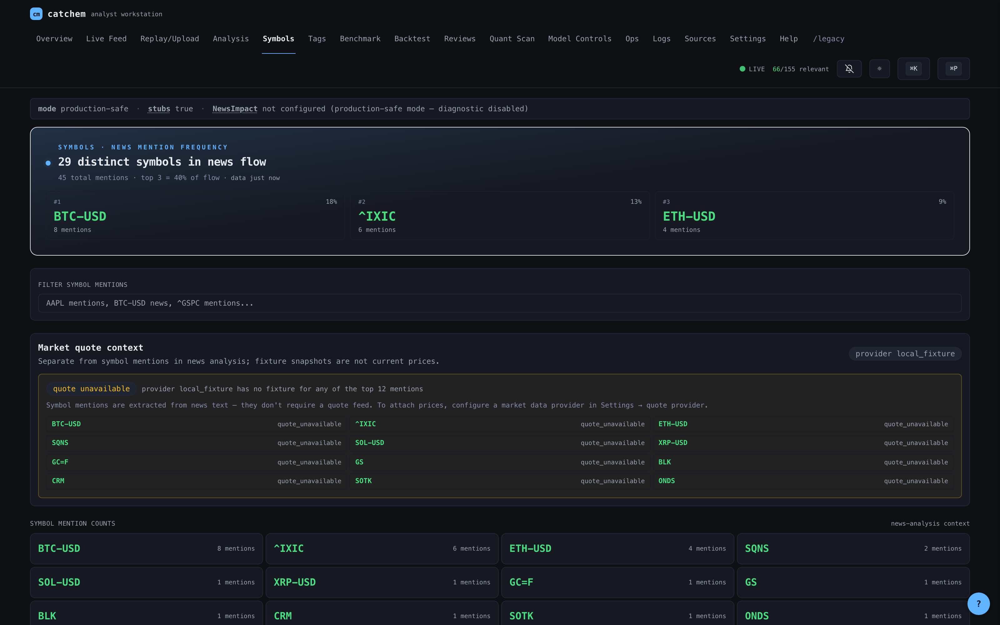
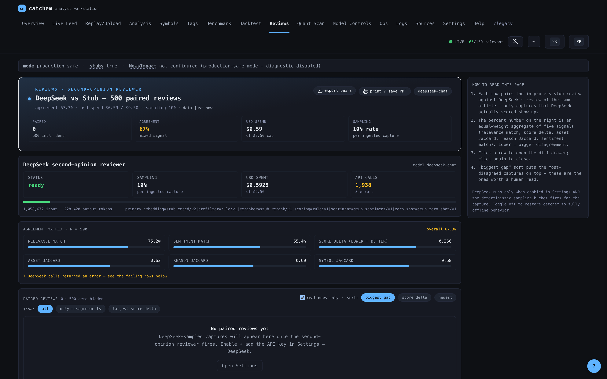

# catchem

A local-first news-to-finance impact engine. Catchem consumes public-text
captures from the **Awareness** ingestion engine, runs them through a guarded
finance-relevance pipeline, scores each with 23 quantitative signals, and
serves the result through a native macOS analyst workstation.

The pipeline is fully offline by default. An optional DeepSeek reviewer can
be enabled per-environment for a hosted-LLM second opinion. NewsImpact is
read-only / quarantined and never trained from this workspace.

> Catchem does not include a live quote or market-price subsystem. Symbol
> pages summarize finance-related news mentions and classifier outputs, not
> current prices or market movement.

## Screenshots

#### Overview — Reading the tape


#### Live Feed — News poller


#### Symbols — Per-symbol news mentions


#### Backtest — Prediction calibration


#### Reviews — Analyst feedback workflow


## Key features

- **Local-first pipeline** — Awareness JSONL → FastAPI sidecar → SQLite,
  with optional Drive archiver for CSV history.
- **~375 awareness sources** polled every 10 s across 6 pluggable parser
  types (RSS + GDELT + GKG + HN Algolia + Reddit + X/Twitter), self-extending
  via auto-discovered source packs (configurable; opt-out via env), plus an
  optional real-time WebSocket/SSE push channel (off by default).
- **23 quant signals** behind one engine: event clustering, topic regime
  detection, anomaly detection, sentiment momentum, lead/lag attribution,
  spillover (cross-asset), novelty, source reliability, co-occurrence,
  market reaction, plus the classifier component scores.
- **DeepSeek AI reviewer** (optional) — sampled second opinion with USD
  cap, deterministic selection per `capture_id`, and budget guardrails.
- **Tauri 2 macOS desktop app** — native menu bar (⌘1–⌘5 tab switch,
  ⌘N paste, ⌘R restart sidecar, etc.), ⌘K command palette, ⌘P global
  search, `?` shortcut overlay, `Esc` dismiss.
- **Light/dark themes** with user-pickable accent color and live theme
  swap.
- **WCAG 2.1 AA accessibility** — skip-link, focus rings, keyboard nav,
  semantic landmarks, error boundaries per route.
- **SQLite storage** with backup/restore (export/import) directly from
  the Settings page.
- **Drive archiver** — auto-detects Google Drive → iCloud → ~/Documents,
  drains old SQLite rows into dated CSVs on a 30 s cadence.
- **Reliability** — graceful sidecar reconnect, SSE live stream with
  staleness probe, route-level error boundaries.
- **500+ backend pytest cases / 200+ Vitest cases** plus the legacy
  guard suite that pins the NewsImpact safety boundary.

## Example output fixtures

Contributor-facing `FinancialImpactRecord` examples live in
[`docs/examples/financial-impact-records`](docs/examples/financial-impact-records).
They cover positive equity news, negative macro/rates news, and a non-finance
control item. The pytest suite validates every JSON file in that directory
against the canonical Pydantic schema.

## Requirements

- macOS 14 (Sonoma) or newer
- Python 3.11+ (the project pins `>=3.11` in `pyproject.toml`)
- Node.js 20+ and npm
- Rust toolchain (`stable`) + `cargo-tauri` 2.x
- Xcode command line tools (`xcode-select --install`)

See [`INSTALL.md`](./INSTALL.md) for the step-by-step setup.

## Quick start

```bash
cd catchem

# 1. Python environment + dependencies (uses uv when available)
uv sync                # or:  bash scripts/catchem_bootstrap_and_run.sh

# 2. Build the release .app and install it under /Applications
bash desktop/catchem/scripts/build_catchem_release.sh
bash desktop/catchem/scripts/install_catchem.sh --release

# 3. Launch
open /Applications/Catchem.app
```

The first launch shows a one-time macOS TCC prompt for Desktop folder
access (so the sidecar can read Awareness JSONL). Click **Allow** once;
subsequent launches do not re-prompt.

For dev with hot reload, swap step 2 for:

```bash
bash desktop/catchem/scripts/build_catchem_dev.sh
```

## Architecture

```
   Awareness (upstream, system of record)
        │
        ▼   committed JSONL captures
   ┌─────────────────────────────────────────────┐
   │  catchem sidecar  (FastAPI · 127.0.0.1:8087)│
   │  ─────────────────────────────────────────  │
   │  • Awareness reader / replay                │
   │  • Finance filter + zero-shot classifier    │
   │  • Sentiment + embeddings + entity linker   │
   │  • QuantEngine (23 signals, fail-soft)      │
   │  • DeepSeek reviewer  (opt-in)              │
   │  • Awareness engine   (~375 feeds, 10 s)    │
   │  • Drive archiver     (CSV history)         │
   │  • SQLite + parquet results                 │
   └─────────────────────────────────────────────┘
        │
        ▼   /, /ui/*, /api/*, /healthz, SSE /ui/stream
   ┌─────────────────────────────────────────────┐
   │  Catchem.app  (Tauri 2 webview, React + TS) │
   │  Native menus · ⌘K palette · ⌘P search      │
   └─────────────────────────────────────────────┘
```

Everything binds to `127.0.0.1`. No outbound HTTP unless the DeepSeek
reviewer is enabled.

## Routes

The premium SPA mounts at `/` and registers 14 routes:

| Path | Page |
|---|---|
| `/` | Overview (KPI hero, distributions, trend, recent flow, benchmark) |
| `/feed` | Live Feed with URL-state filters and detail drawer |
| `/feed/:captureId` | Live Feed with the named capture opened |
| `/replay` | Replay / Upload — paste or drop JSONL for processing |
| `/map` | Analysis Map — asset-class × reason-code heatmap |
| `/symbols` | Symbol mentions explorer |
| `/symbols/:sym` | Symbol detail page |
| `/benchmark` | Golden-set precision/recall/F1, per-item, history |
| `/reviews` | Reviews Compare — side-by-side classifier vs DeepSeek |
| `/scan` | Quant Scan — events, sentiment, sources, network tabs |
| `/portfolio` | Read-only holdings tracker joined to the awareness layer (no order execution) |
| `/model-controls` | Model controls + gate status |
| `/ops` | System health, guard status, model versions, DLQ |
| `/logs` | Sidecar log stream (live, structured) |
| `/settings` | Theme, accent, shortcuts, DeepSeek, backup/restore |
| `/help` | Help index, jargon dictionary, shortcut reference |
| `/legacy` | The vanilla pre-redesign dashboard |

## Keyboard shortcuts

| Chord | Action |
|---|---|
| `⌘K` | Open the command palette |
| `⌘P` | Open the global search palette |
| `?` | Show the shortcut overlay |
| `Esc` | Close drawers, modals, palettes |
| `g o` | Overview |
| `g f` | Live Feed |
| `g r` | Replay / Upload |
| `g a` (alias `g m`) | Analysis Map |
| `g s` | Symbols |
| `g b` | Benchmark |
| `g v` | Reviews Compare |
| `g q` | Quant Scan |
| `g c` | Model Controls |
| `g x` | System / Ops |
| `g l` | Logs |
| `g h` | Help |
| `g ,` | Settings |

Chords are defined once in `frontend/src/lib/nav-shortcuts.ts` — palette,
help page, settings, and the keydown handler all read from that registry.

## API reference

The sidecar serves three programmatic surfaces in addition to the HTML UI:

| Route | Purpose |
|---|---|
| `GET /api/docs` | Swagger UI (FastAPI default, remapped under `/api`) |
| `GET /api/openapi.json` | Full OpenAPI 3 schema |
| `GET /api/_index` | Plain JSON list of every registered `/api`, `/ui`, and health route |
| `GET /healthz` | Liveness probe used by the Tauri boot shim |
| `GET /ui/summary` | One-shot landing payload (counts, distributions, snapshot) |
| `GET /ui/stream` | Server-sent events: `summary`, `tick` |

The full record + aggregation surface (`/ui/*`, `/recent`, `/record/{id}`,
`/replay`, `/process-one`, etc.) is documented inline at `/api/docs`.

## Configuration

Settings live in `src/catchem/settings.py` (pydantic-settings). Env vars
use the `CATCHEM_` prefix and `__` for nested fields. A starter
[`.env.example`](./.env.example) ships in the repo root.

Commonly-touched variables:

| Variable | Default | Purpose |
|---|---|---|
| `CATCHEM_MODE` | `production_safe` | one of `production_safe`, `replay_existing`, `live_tail`, `research_diagnostic` |
| `CATCHEM_USE_ML_STUBS` | `true` | skip heavy ML model loads for CPU-only smoke tests |
| `CATCHEM_API__HOST` / `CATCHEM_API__PORT` | `127.0.0.1` / `8087` | sidecar bind address |
| `CATCHEM_NEWS__POLLER_ENABLED` | `true` | toggle the ~375-feed awareness poller |
| `CATCHEM_NEWS__POLL_INTERVAL_SECONDS` | `10.0` | poller cadence |
| `CATCHEM_ARCHIVE__ENABLED` | `true` | drain old SQLite rows into a Drive CSV |
| `CATCHEM_ARCHIVE__DRIVE_DIR` | _auto-detect_ | Drive / iCloud / Documents path override |
| `CATCHEM_REVIEWERS__DEEPSEEK__ENABLED` | `false` | turn on the optional DeepSeek reviewer |
| `CATCHEM_REVIEWERS__DEEPSEEK__API_KEY` | `""` | DeepSeek API key (empty disables) |
| `CATCHEM_REVIEWERS__DEEPSEEK__SAMPLING_RATE` | `0.10` | fraction of captures that get a second opinion |
| `CATCHEM_REVIEWERS__DEEPSEEK__USD_CAP` | `9.50` | hard spend ceiling for the reviewer |
| `CATCHEM_GUARDS__NEWSIMPACT_DIAGNOSTIC_ENABLED` | `false` | NewsImpact read-only diagnostic (research mode only) |

Refer to `src/catchem/settings.py` for the full list, including the
`models`, `replay`, `live`, `storage`, `logging`, `thresholds`, and
`kaggle` sub-configs.

## Modes

| Mode | Description | NewsImpact diagnostic |
|---|---|---|
| `production_safe` | Default. Pipeline only, no diagnostic adapter. | never |
| `replay_existing` | Process committed JSONL once. Used by tests. | no |
| `live_tail` | Long-running tail of new JSONL chunks. | no |
| `research_diagnostic` | Live tail **plus** read-only NewsImpact stamp. | yes (read-only, labeled) |

The diagnostic adapter is built lazily and refuses to start when
`guards.newsimpact_diagnostic_enabled` is `false` or the release gate
has flipped.

## CLI

```bash
catchem run --mode replay_existing
catchem replay --path data/awareness/jsonl/captures/.../X.jsonl
catchem inspect --capture-id <id>
catchem benchmark --golden
catchem validate-guards
catchem status
catchem serve
```

## Tests

```bash
make test              # all Python tests
make test-fast         # skip ml / smoke / integration
make test-guards       # NewsImpact guard suite — must always be green
make test-smoke        # end-to-end bootstrap
(cd frontend && npm test)         # Vitest UI suite
(cd frontend && npm run build:check)  # build + enforce per-chunk size budget
(cd frontend && npm run analyze)      # opt-in: open bundle-stats.html treemap
```

`build:check` runs `vite build` then `scripts/check-bundle-budget.js`, which
gzips every emitted JS chunk and compares it against the per-prefix ceilings
declared in that script. CI / release builds should chain `build:check` so a
regression (e.g. accidentally hoisting echarts into the entry shell) is
caught before it ships. Use `npm run analyze` to investigate a regression —
it sets `ANALYZE=true`, which wires in `rollup-plugin-visualizer` and opens
an interactive treemap of the bundle with gzip + brotli sizes.

## Layout

```
catchem/
├── configs/                  catchem.yaml, taxonomy.yaml, source_of_truth.yaml
├── desktop/catchem/          Tauri 2 macOS shell + build scripts
├── docs/                     SYSTEM_OVERVIEW, RUNBOOK, CATCHEM_APP, ...
├── frontend/                 React + TypeScript + Vite source
├── scripts/                  bootstrap, HF warm, Kaggle, guard verifier
├── src/catchem/
│   ├── settings.py · schemas.py · taxonomy.py
│   ├── storage.py · awareness_reader.py · awareness_replay.py
│   ├── finance_filter.py · zero_shot_classifier.py · sentiment.py
│   ├── embeddings.py · reranker.py · entity_linker.py
│   ├── symbol_mapper.py · channel_mapper.py · chart_context.py
│   ├── evidence.py · scoring.py
│   ├── news_poller.py · archive.py · deepseek_reviewer.py
│   ├── quant/                23 signals, behind QuantEngine
│   ├── newsimpact_guarded_adapter.py    ← the safety boundary
│   ├── golden.py                        ← synthetic benchmark
│   ├── service.py · supervisor.py · dashboard_data.py · bootstrap.py
│   ├── api.py                           ← FastAPI + /ui/* + SSE + SPA serving
│   ├── cli.py                           ← Typer
│   └── static/
│       ├── dashboard.html               ← legacy vanilla dashboard
│       └── app/                         ← built React bundle (generated)
└── tests/                    pytest — guard + unit + integration + smoke + /ui
```

## Constraints

- No training of NewsImpact.
- No promotion or publication of NewsImpact artifacts.
- No writes to `final_best.pt` or anywhere under `models/`.
- No destructive merge of the upstream repos.
- No required runtime dependency on paid APIs or Kaggle credentials.

See `docs/SOURCE_OF_TRUTH.md` for the full statement of authority.

## License + acknowledgments

MIT, see `pyproject.toml`. Catchem stands on top of the Awareness ingestion
engine and (read-only) the NewsImpact research codebase. Heavy lifting in
the classifier path comes from Hugging Face Transformers, scikit-learn,
sentence-transformers, FinBERT, and BART-MNLI. The desktop shell uses
Tauri 2 and React.
