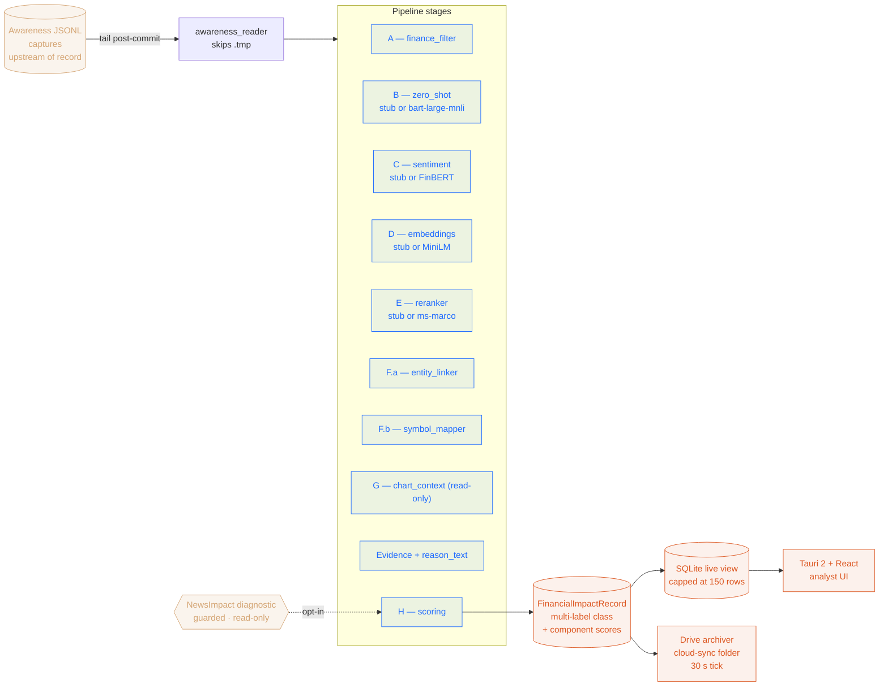
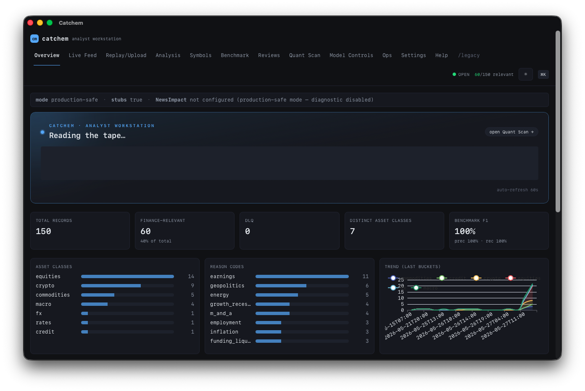
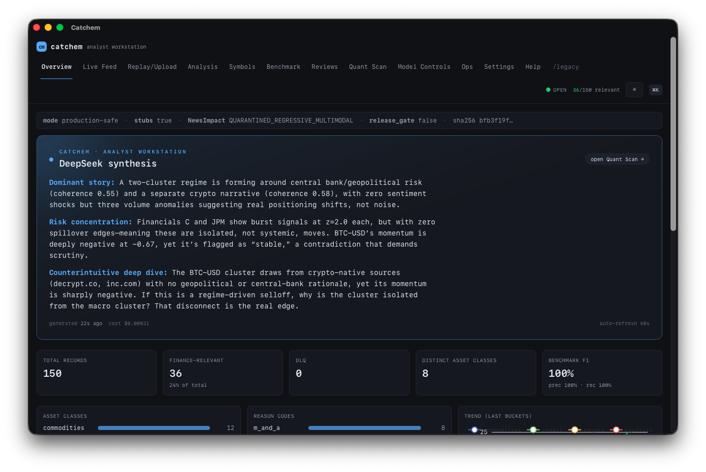

# catchem

[](LICENSE)
[](https://github.com/nazmiefearmutcu/catchem/stargazers)
[](https://python.org)
[](https://tauri.app/)
[](#tests)

Local-first sidecar workspace that fuses two existing systems:

- **Awareness** — public-text ingestion engine (stable upstream, system of record).
- **NewsImpact** — multimodal candidate that is **currently quarantined** and
  permitted only as a read-only diagnostic.

`catchem` consumes Awareness JSONL captures **after** they are durably
committed and emits one `FinancialImpactRecord` per capture: a multi-label
classification of asset class / impact reason / symbols / sentiment / evidence,
together with the component scores that produced the decision.

This repo never modifies Awareness or NewsImpact source. It is reversible:
deleting it has zero effect on either upstream system.

## Data flow (at a glance)



## Preview

> Native macOS `.app` (Tauri shell + Python FastAPI sidecar + React UI). Launch from `/Applications/Catchem.app`.

| Analyst workstation overview | DeepSeek capture synthesis |
| --- | --- |
|  |  |

The Overview pane is the analyst's home: live KPIs, asset-class distribution,
reason-code breakdown, and a relevance trend. Click any capture to drill into a
full analyst writeup like the DeepSeek synthesis shown above.

## One-command bootstrap

```bash
bash scripts/catchem_bootstrap_and_run.sh
```

What it does (idempotent):

1. creates `.venv` via `uv` (falls back to `python -m venv`)
2. installs `fusion_stack[dev]` editable
3. installs `awareness` editable if available
4. verifies both repo paths
5. runs the NewsImpact guard verifier — aborts if the release gate has flipped
6. (optional) warms HF model caches when `--with-ml` is set
7. (optional) attempts Kaggle dataset downloads if credentials exist
8. initializes `data/{results,db,logs,cache,vector_index,...}`
9. runs replay mode against Awareness JSONL (default `--max=50`)
10. starts the local API on `127.0.0.1:8087` in the background
11. prints a summary

Flags:
- `--with-ml` — install + warm the HF model extras
- `--no-api` — skip starting the API
- `--mode=...` — `production_safe` | `replay_existing` (default) | `live_tail` | `research_diagnostic`
- `--max=N` — replay record cap
- `--skip-run` — only do setup, don't run the pipeline

## Modes

| Mode | Description | NewsImpact diagnostic |
|---|---|---|
| `production_safe` | Default. Pipeline only, no diagnostic adapter. | ❌ never |
| `replay_existing` | Process committed JSONL once. Used by tests. | ❌ |
| `live_tail` | Long-running tail of new JSONL chunks. | ❌ |
| `research_diagnostic` | Same as live, **plus** a read-only diagnostic stamp from NewsImpact governance. | ✅ (read-only, labeled) |

The diagnostic adapter is constructed lazily and refuses to start in any mode
where `guards.newsimpact_diagnostic_enabled` is false or
`gate_failure_status.release_gate_passed` is true.

## API

Local-only, binds to `127.0.0.1:8087`.

| Endpoint | Purpose |
|---|---|
| `GET /healthz` | liveness |
| `GET /config` | mode + diagnostic state |
| `GET /metrics` | counts + DLQ |
| `GET /dashboard` | pre-shaped overview |
| `GET /recent` | recent FinancialImpactRecord rows |
| `GET /record/{capture_id}` | one record |
| `GET /records/by-symbol/{symbol}` | reverse lookup |
| `GET /records/by-asset-class/{ac}` | filter |
| `GET /records/by-reason/{rc}` | filter |
| `POST /replay` | run one replay pass |
| `POST /process-one` | run one capture through the pipeline |

## CLI

```bash
fusion-stack run --mode replay_existing
fusion-stack replay --path data/awareness/jsonl/captures/.../X.jsonl
fusion-stack inspect --capture-id <id>
fusion-stack benchmark
fusion-stack validate-guards
fusion-stack status
fusion-stack serve
```

## Tests

```bash
make test           # everything
make test-fast      # skip ml/smoke/integration
make test-guards    # guard suite only (must always be green)
make test-smoke     # end-to-end + bootstrap shell
```

## Layout

```
fusion_stack/
├── configs/                 fusion.yaml, taxonomy.yaml, source_of_truth.yaml
├── docs/                    SYSTEM_OVERVIEW, RUNBOOK, TEST_MATRIX, SOURCE_OF_TRUTH
├── scripts/                 bootstrap shell + HF warm + Kaggle (optional) + guard verifier
├── src/fusion_stack/
│   ├── settings.py          pydantic-settings (yaml + env)
│   ├── schemas.py           AwarenessCaptureView, FinancialImpactRecord
│   ├── taxonomy.py          loader for configs/taxonomy.yaml
│   ├── storage.py           SQLite + parquet + DLQ + offsets
│   ├── awareness_reader.py  post-commit JSONL iterator (skips .tmp)
│   ├── awareness_replay.py  resumable runner with offsets
│   ├── finance_filter.py    Stage A
│   ├── zero_shot_classifier.py  Stage B (stub + bart-large-mnli)
│   ├── sentiment.py         Stage C (stub + FinBERT)
│   ├── embeddings.py        Stage D (stub + MiniLM) + VectorIndex
│   ├── reranker.py          Stage E (stub + ms-marco)
│   ├── entity_linker.py     Stage F.a (regex + lexicons)
│   ├── symbol_mapper.py     Stage F.b (internal registry + optional NewsImpact)
│   ├── channel_mapper.py    asset×reason → market channel
│   ├── chart_context.py     Stage G (read-only; metadata only)
│   ├── evidence.py          extractive sentences + reason_text
│   ├── scoring.py           Stage H final decision
│   ├── newsimpact_guarded_adapter.py  guarded diagnostic adapter
│   ├── service.py           FusionService (orchestrates stages)
│   ├── supervisor.py        owns Settings → Storage → Service → Replay/Tail
│   ├── api.py               FastAPI
│   ├── cli.py               Typer
│   ├── bootstrap.py         programmatic bootstrap
│   └── dashboard_data.py    JSON shaping for /dashboard
└── tests/                   guard + unit + integration + smoke
```

## Constraints (non-negotiable)

- **No** training of NewsImpact.
- **No** promotion / publication / release of NewsImpact artifacts.
- **No** writes to `final_best.pt` or anywhere under `models/`.
- **No** destructive merge of the original repos.
- **No** runtime dependency on paid APIs or Kaggle credentials.

See `docs/SOURCE_OF_TRUTH.md` for the full statement of authority.
