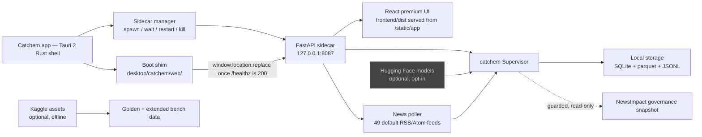
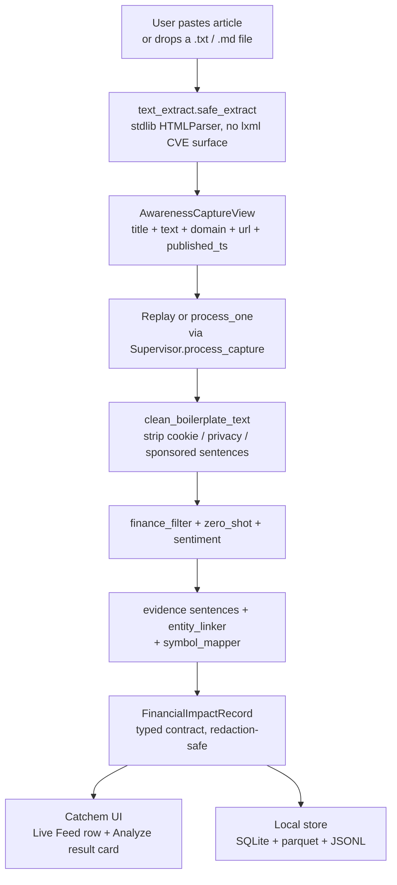
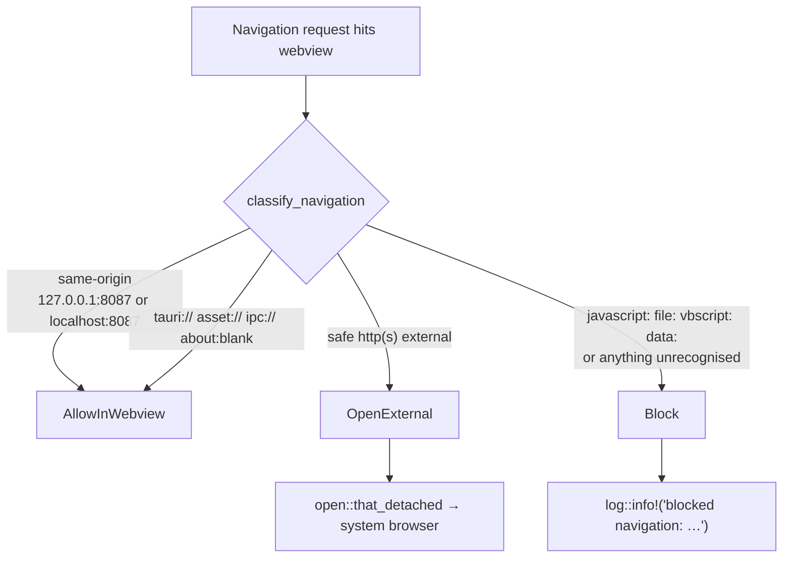

# Catchem Architecture

Catchem is a local-first macOS desktop wrapper around the catchem pipeline. The whole system runs on the analyst's laptop: a Rust shell, a Python sidecar, a React UI, and a local SQLite store. No outbound data leaves the machine unless the analyst clicks a news link (which opens in the system browser, not the webview).

## Component map



The dashed line to NewsImpact is the production-safe guard surface: Catchem reads the governance snapshot to confirm `release_gate_passed=false` and refuses to promote diagnostic output. No write path crosses that boundary.

## Boot sequence

```mermaid
stateDiagram-v2
    [*] --> Spawning : Rust setup() runs
    Spawning --> WaitingHealth : sidecar Pid handed to manager
    WaitingHealth --> WindowOpen : 30 s timeout cap
    WaitingHealth --> Ready : /healthz == 200
    WindowOpen --> Ready : shim fetch() loop catches up
    Ready --> Running : window.location.replace to FastAPI
    Running --> Restarting : ⌘R or menu → Sidecar Restart
    Restarting --> WaitingHealth
    Running --> [*] : window close → SidecarState::stop
```

Two synchronisation points cooperate:
1. The Rust `block_on(wait_for_health, 30 s)` in `setup()` so the log records sidecar readiness before the window opens.
2. The boot shim's `fetch(/healthz)` poll so the user sees stage transitions in the UI.

Either one alone would be enough on a fast Mac; together they handle slow PyInstaller cold-starts (~3-5 s) and TCC-blocked first launches (Python silently hangs on Desktop open until the user grants Files-and-Folders consent).

## Capture → record dataflow



Two redaction layers, defense-in-depth:
- `pipeline.py` emits `diagnostic_multimodal_*` as `False / None` in `production_safe` mode.
- `redaction.redact_record_for_mode()` re-scrubs the payload before it crosses any API boundary, regardless of how the row was written.

## Webview navigation policy



`classify_navigation` lives in `desktop/catchem/src-tauri/src/security.rs` as a pure function so the policy is unit-testable. The on_navigation closure in `lib.rs` is a one-line enum match around it.

## Data paths

| Layer            | Dev build                                          | Release build (.app)                                    |
|------------------|----------------------------------------------------|---------------------------------------------------------|
| Sidecar python   | `<repo>/.venv/bin/python`                          | `Catchem.app/Contents/Resources/sidecar/catchem-sidecar` |
| Sidecar cwd      | repo root                                          | `~/Library/Application Support/Catchem/`                |
| Output dir       | `<repo>/data/`                                     | `~/Library/Application Support/Catchem/data/`           |
| Awareness inbox  | `CATCHEM_PATHS__AWARENESS_DATA_DIR` env, default off| `~/Library/Application Support/Catchem/awareness-data/` |
| Logs             | `<repo>/data/logs/api.out` + sidecar.log           | `~/Library/Logs/Catchem/sidecar.log`                    |
| Config (yaml)    | `<repo>/configs/`                                  | shipped inside the PyInstaller bundle                   |

Release-mode env vars are set by `sidecar.rs:start()` when `cfg.release_mode == true` — see `feature/catchem-hardening` commit `21dfd7f`.

## Static assets

The React premium UI is built once into `frontend/dist`, then copied to `src/catchem/static/app/` by `scripts/catchem_bootstrap_and_run.sh`. The FastAPI app mounts that directory under `/`. `importlib.resources` is used wherever the path crosses an install boundary, so the bundle survives `pip install` into a fresh venv.

The boot shim is a separate, much smaller Vite project under `desktop/catchem/web/`. It builds to `desktop/catchem/web/dist/` which `tauri.conf.json` references as `frontendDist`.

## Threat model (short)

| Surface                                  | Mitigation                                                                                              |
|------------------------------------------|---------------------------------------------------------------------------------------------------------|
| Untrusted news article HTML              | stdlib HTMLParser-based safe extractor; no lxml; explicit allowlist of upload MIME types + 5 MB cap     |
| RSS feed XML                             | hardcoded feed allowlist; stdlib xml.etree; no external entities by default; per-feed health tracking   |
| Cross-site links in articles             | webview `on_navigation` blocks anything not in `is_allowed_internal_url`; safe ones go to system browser|
| Inline scripts in boot shim              | explicit CSP with `'unsafe-inline'` scoped to `script-src`; no innerHTML usage; XSS hook enforced       |
| Diagnostic leakage in production_safe    | `redaction.redact_record_for_mode` server-side scrub on every API surface; sidecar pins env to disabled |
| Local filesystem leakage via API         | `safe_guard_view` strips `governance_index_path` and any error strings; `/ui/app-info` test pins this   |
| Bundle write attempts (release)          | sidecar cwd forced to `~/Library/Application Support/Catchem/`; bundle remains read-only                |
| TCC prompt fatigue                       | `inject_info_plist.sh` is idempotent (only writes if value differs); preserves bundle cdhash            |
